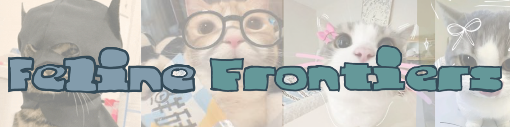

# hello! this is the alpha server for Feline Frontiers Alpha builds.
# if you’re here, you’re either curious, lost, or extremely silly. all three are valid.

---

🍁 what is hinkoyoshi?

Hinkoyoshi is the official Alpha‑phase backend server for the upcoming game Feline Frontiers.

• it ONLY works with alpha builds
• it is not used in the main game
• it is intentionally simple, janky, and experimental
• it exists so the Alpha client has something to talk to

think of it as the “training wheels” server before the real backend arrives.

---

💧 cool cool. so how do i use it?

1. go to the Releases tab on this repo
2. find the latest build
3. download the file named Kyoko1.zip
4. extract it
5. run the executable inside

boom. you’re hosting a Hinkoyoshi server.

---

🍀 but what if i don’t have the build?

you can find the Alpha builds in the F.F Archive
(currently not up yet — will be up soon!)

once it’s up, download the Alpha build that supports Hinkoyoshi.

---

🎨 ooo! cool! but what are the necessities?

Hinkoyoshi requires:

• Go 1.20 or above
• that’s literally it

no database
no cloud
no cluster
no IL2CPP
no nothing

just Go.

---

📁 where are the logs?

Hinkoyoshi writes logs to:

C:\Users\your.user\Roaming\FelineFrontiers\DestinyJoke\logs.txt

yes, the folder is called DestinyJoke.
no, i will not explain why.

---

👾 is this the end of the readme?

yes. yes it is.

if you need help or found a bug, contact me on discord:
insanityforeternity

have fun, stay silly, and enjoy the frontier.

---